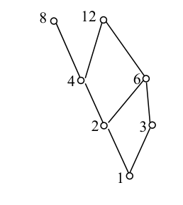

# 河南大学计算机与信息工程学院 2013～2014 学年第一学期期末考试

## 《 离散数学 》试卷（A 卷）参考答案及解析

**考试方式：** 闭卷
**考试时间：** 120 分钟
**卷面总分：** 100 分
**适用专业：** 计算机科学与技术 / 软件工程 / 网络工程 / 人工智能

---

## 一、 单项选择题（本题共 15 小题，每小题 2 分，共 30 分）

**1. 用 $P$ 表示命题“派小王参加下周的会议”，用 $Q$ 表示命题“派小李参加下周的会议”，则命题“小王和小李两个人中必须派一人且只能派一人参加下周 of 的会议”可以表示为______。** **[ C ]**

* A. $P \wedge \neg Q$
* B. $P \to \neg Q$
* C. $(\neg P \wedge Q) \vee (P \wedge \neg Q)$
* D. $(P \to \neg Q) \vee (Q \to \neg P)$

**2. 设命题公式 $G$ 为：$\neg P \to (Q \wedge R)$，则下列选项中（依次为 $P, Q, R$ 的真值）哪个是公式 $G$ 的成假解释______。** **[ C ]**

* A. T, F, T
* B. T, T, T
* C. F, F, F
* D. F, T, T

**3. 下列公式中正确的等价式是______。** **[ B ]**

* A. $\neg (\exists x) A(x) \Leftrightarrow (\exists x) \neg A(x)$
* B. $\neg (\forall x) A(x) \Leftrightarrow (\exists x) \neg A(x)$
* C. $(\forall x)(\forall y) A(x, y) \Leftrightarrow (\exists y)(\forall x) A(x, y)$
* D. $(\forall x)(A(x) \vee B(x)) \Leftrightarrow (\forall x)A(x) \vee (\forall x)B(x)$

**4. 设 $X, Y, Z$ 为任意集合，且 $X \oplus Y = \{1, 2, 3\}$，$X \oplus Z = \{2, 3, 4\}$，若 $2 \in Y$，则一定有______。** **[ B ]**

* A. $1 \in Z$
* B. $2 \in Z$
* C. $3 \in Z$
* D. $4 \in Z$

**5. 下列函数是双射的是______。** **[ A ]**

* A. $f: \mathbf{R} \to \mathbf{R}, f(x) = 2x + 1$
* B. $f: \mathbf{Z}^+ \to \mathbf{R}, f(x) = \ln x$ （其中 $\mathbf{Z}^+$ 为正整数集）
* C. $f: \mathbf{R} \to \mathbf{Z}, f(x) = \lfloor x \rfloor$
* D. $f: \mathbf{R} \to \mathbf{R}, f(x) = -x^2 + 2x - 1$

---

**6. 下列选项哪一项构成集合 $\{a, b, c, d, e, f, g\}$ 的划分______。** **[ D ]**

* A. $\{\{a, b, c\}, \{d, e\}, \{f, g, h\}\}$
* B. $\{\{a, b\}, \{c, d, e\}, \{e, f, g\}\}$
* C. $\{\{a \}, \{b, c, d\}, \{f, g\}\}$
* D. $\{\{a, b, c, d\}, \{e\}, \{f, g\}\}$

**7. 设 $S = \{1, 2, 3\}$，其上二元关系 $R$ 的关系图如图 1 所示，则 $R$ 具有______性质。** **[ D ]**

  
  
<em>图1</em>

* A. 自反性、对称性、传递性
* B. 自反性、反对称性
* C. 自反性、反对称性、传递性
* D. 自反性

**8. 设 $S = \{0, 1\}$，$*$ 为普通乘法，则 $\langle S, * \rangle$ 是______。** **[ B ]**

* A. 半群，但不是独异点
* B. 只是独异点，但不是群
* C. 群
* D. 环，但不是群

**9. 在______中，补元是唯一的。** **[ D ]**

* A. 有界格
* B. 有补格
* C. 分配格
* D. 有补分配格

**10. 下面偏序集中的图______能构成格。** **[ B ]**

  
  
<em>图2</em>

* A. 图 A
* B. 图 B
* C. 图 C
* D. 图 D

---

**11. 设 $+$ 和 $\circ$ 为普通加法和普通乘法，则下列集合 $S$ 与 $+$, $\circ$ 可以构成域的是______。** **[ D ]**

* A. $S = \{x \mid x = 2n \wedge n \in \mathbf{Z}\}$
* B. $S = \{x \mid x = 2n + 1 \wedge n \in \mathbf{Z}\}$
* C. $S = \{x \mid x \in \mathbf{Z} \wedge x \ge 0\} = \mathbf{N}$
* D. $S = \{x \mid x = a + b\sqrt{3}, a, b \in \mathbf{Q}\}$

**12. 设 $G$ 是 5 个顶点的完全图，则从 $G$ 中删去______条边可以得到树。** **[ A ]**

* A. 6
* B. 5
* C. 10
* D. 4

**13. 在一棵树中有 7 片树叶，3 个 3 度结点，其余都是 4 度结点，则该树有______个 4 度结点。** **[ A ]**

* A. 1
* B. 2
* C. 3
* D. 4

**14. 下图中，______是欧拉图。** **[ C ]**

  
  
<em>图3</em>

* A. 图 A
* B. 图 B
* C. 图 C
* D. 图 D

**15. 下图所示的二叉树中，后序遍历的结果是______。** **[ C ]**

  
  
<em>图4</em>

* A. abcde
* B. edcba
* C. bdeca
* D. badce

---

## 二、 填空题（本题共 10 空，每空 2 分，共 20 分）

**1. 设集合 $A = \{x \mid x = n^2 \wedge x \in \mathbf{N}\}$，$\mathbf{N}$ 为自然数集，则 $A$ 的基数为______** **$\aleph_0$** **。**

**2. 设集合 $A = \{\{1,2\}, 1\}$，则幂集 $P(A) = $______** **$\{\emptyset, \{1\}, \{\{1,2\}\}, A\}$** **。**

**3. 设集合 $A = \{1, 2, 3, 4\}$，$A$ 上的二元关系 $R = \{\langle 1,1 \rangle, \langle 1,2 \rangle, \langle 2,3 \rangle\}$，$S = \{\langle 1,3 \rangle, \langle 2,3 \rangle, \langle 3,2 \rangle\}$，则 $R \circ S = $______** **$\{\langle 1,3 \rangle, \langle 2,2 \rangle\}$** **。**

**4. 设关系 $R = \{\langle 1,1 \rangle, \langle 1,2 \rangle, \langle 2,3 \rangle\}$，则 $R$ 的对称闭包是______** **$\{\langle 1,1 \rangle, \langle 1,2 \rangle, \langle 2,1 \rangle, \langle 2,3 \rangle, \langle 3,2 \rangle\}$** **。**

**5. 设 $G = \langle a \rangle$ 是 15 阶循环群，则 $G$ 的所有生成元个数有______** **$8$** **个。**

**6. 设 $\mathbf{Z}$ 为整数集，$\forall a, b \in \mathbf{Z}$，$a \circ b = a + b - 1$，则任意 $a \in \mathbf{Z}$ 的逆元 $a^{-1} = $______** **$2 - a$** **。**

**7. 设 $G = \langle a \rangle$ 为 12 阶循环群，则 $G$ 的 4 阶子群是______** **$\langle a^3 \rangle$ 或 $\{e, a^3, a^6, a^9\}$** **。**

**8. 设连通平面图有 $n$ 个结点，$m$ 条边，$r$ 个面，则它们的关系是______** **$n - m + r = 2$** **。**

**9. 所有非同构 of 5 阶根树有______** **$9$** **棵。**

**10. 高为 $h$ 的正则 2 叉树至少有______** **$h + 1$** **片树叶。**

---

## 三、 计算题（本题共 4 小题，每小题 10 分，共 40 分）

**1. 求公式 $(P \to (R \vee P)) \wedge (Q \leftrightarrow P)$ 的主合取范式及主析取范式。**

> **【参考答案】**
> 公式等值演算法求解过程如下：
> 
> $$
> \begin{aligned}
> & (P \to (R \vee P)) \wedge (Q \leftrightarrow P) \\
> \Leftrightarrow & (\neg P \vee (R \vee P)) \wedge (\neg Q \vee P) \wedge (\neg P \vee Q) \\
> \Leftrightarrow & (T \vee R) \wedge (\neg Q \vee P) \wedge (\neg P \vee Q) \\
> \Leftrightarrow & (\neg Q \vee P) \wedge (\neg P \vee Q)
> \end{aligned}
> $$
> 
> **(1) 求主合取范式**：
> 
> $$
> \begin{aligned}
> & (\neg Q \vee P) \wedge (\neg P \vee Q) \\
> \Leftrightarrow & (P \vee \neg Q \vee (R \wedge \neg R)) \wedge (\neg P \vee Q \vee (R \wedge \neg R)) \\
> \Leftrightarrow & (P \vee \neg Q \vee R) \wedge (P \vee \neg Q \vee \neg R) \wedge (\neg P \vee Q \vee R) \wedge (\neg P \vee Q \vee \neg R)
> \end{aligned}
> $$
> 
> 对应最大项编码为：$M_2 \wedge M_3 \wedge M_4 \wedge M_5$，即：
> 主合取范式为：$(P \vee \neg Q \vee R) \wedge (P \vee \neg Q \vee \neg R) \wedge (\neg P \vee Q \vee R) \wedge (\neg P \vee Q \vee \neg R)$。
> 
> **(2) 求主析取范式**：
> 对应小项为除 $m_2, m_3, m_4, m_5$ 之外的小项，即 $m_0, m_1, m_6, m_7$。
> 编码表示为：$m_0 \vee m_1 \vee m_6 \vee m_7$，即：
> 主析取范式为：$(\neg P \wedge \neg Q \wedge \neg R) \vee (\neg P \wedge \neg Q \wedge R) \vee (P \wedge Q \wedge \neg R) \vee (P \wedge Q \wedge R)$。

**2. 设集合 $A = \{1, 2, 3, 4, 6, 8, 12\}$，$R$ 为 $A$ 上的整除关系。**
*(1)* 画出偏序集 $\langle A, R \rangle$ 的哈斯图；
*(2)* 写出 $A$ 的子集 $B = \{4, 6\}$ 的上确界，下确界；
*(3)* 写出 $A$ 的最大元，最小元，极大元，极小元。

> **【参考答案】**
> *(1)* $\langle A, R \rangle$ 的哈斯图如下图所示：
> 
> 

>   
> 

> 
> *(2)* 
> - 子集 $B = \{4,6\}$ 的公倍数（上界）在 $A$ 中为 $\{12\}$，故上确界为 **$12$**；
> - 子集 $B = \{4,6\}$ 的公约数（下界）在 $A$ 中为 $\{1, 2\}$，故下确界为 **$2$**。
> 
> *(3)* 
> - 最大元：**无**（因为 $8$ 和 $12$ 都是极大元，它们不可比）
> - 最小元：**$1$**
> - 极大元：**$8, 12$**
> - 极小元：**$1$**

**3. 设 $\langle \mathbf{Z}_6, +_6 \rangle$ 是一个群，这里 $+_6$ 是模 6 加法，$\mathbf{Z}_6 = \{0, 1, 2, 3, 4, 5\}$，试求出 $\langle \mathbf{Z}_6, +_6 \rangle$ 的所有子群及其相应左陪集。**

> **【参考答案】**
> $\langle \mathbf{Z}_6, +_6 \rangle$ 是一个 6 阶有限循环群，其子群的阶数必须是 6 的因子（即 1, 2, 3, 6）。
> 所有子群有：
> 1. **1阶子群**：$H_1 = \langle \{0\}, +_6 \rangle$
>    - 左陪集为：
>      - $\{0\} +_6 0 = \{0\} +_6 1 = \{1\}$，$\{0\} +_6 2 = \{2\}$，$\{0\} +_6 3 = \{3\}$，$\{0\} +_6 4 = \{4\}$，$\{0\} +_6 5 = \{5\}$。
>      - 即：$\{0\}, \{1\}, \{2\}, \{3\}, \{4\}, \{5\}$。
> 2. **2阶子群**：$H_2 = \langle \{0, 3\}, +_6 \rangle$
>    - 左陪集为：
>      - $\{0, 3\} +_6 0 = \{0, 3\}$
>      - $\{0, 3\} +_6 1 = \{1, 4\}$
>      - $\{0, 3\} +_6 2 = \{2, 5\}$
> 3. **3阶子群**：$H_3 = \langle \{0, 2, 4\}, +_6 \rangle$
>    - 左陪集为：
>      - $\{0, 2, 4\} +_6 0 = \{0, 2, 4\}$
>      - $\{0, 2, 4\} +_6 1 = \{1, 3, 5\}$
> 4. **6阶子群**：$H_4 = \langle \mathbf{Z}_6, +_6 \rangle$
>    - 左陪集只有自身：$\mathbf{Z}_6$。

**4. 一公司在五个城市 $C_1, C_2, \dots, C_5$ 中都有分公司，从 $C_i$ 到 $C_j$ 的班机费如下图所示，对上述五个城市中计算 $C_1$ 到其它城市费用最低的路线。（要求写出求解过程）**

> **【参考答案】**
> 使用 Dijkstra 算法计算从起点 $C_1$ 到其他各个顶点的最短路径，迭代步骤如下表所示：
> 
> | 步骤 / 已选择点 | 已加入顶点集 $S$ | $D(C_1)$ | $D(C_2)$ | $D(C_3)$ | $D(C_4)$ | $D(C_5)$ |
> | :---: | :---: | :---: | :---: | :---: | :---: | :---: |
> | 初始状态 | $\{C_1\}$ | 0 | 2 (来自 $C_1$) | $+\infty$ | $+\infty$ | 10 (来自 $C_1$) |
> | 第 1 步 | $\{C_1, C_2\}$ | 0 | 2 | 5 (来自 $C_2$) | $+\infty$ | 9 (来自 $C_2$) |
> | 第 2 步 | $\{C_1, C_2, C_3\}$ | 0 | 2 | 5 | 9 (来自 $C_3$) | 9 (来自 $C_2$) |
> | 第 3 步 | $\{C_1, C_2, C_3, C_4\}$ | 0 | 2 | 5 | 9 | 9 (来自 $C_2$) |
> | 第 4 步 | $\{C_1, C_2, C_3, C_4, C_5\}$ | 0 | 2 | 5 | 9 | 9 |
> 
> 最终求得从 $C_1$ 出发至各城市费用最低的路线及费用分别为：
> - 至 $C_2$：路线为 **$C_1 \to C_2$**，最低费用为 **2**；
> - 至 $C_3$：路线为 **$C_1 \to C_2 \to C_3$**，最低费用为 **5**；
> - 至 $C_4$：路线为 **$C_1 \to C_2 \to C_3 \to C_4$**，最低费用为 **9**；
> - 至 $C_5$：路线为 **$C_1 \to C_2 \to C_5$**，最低费用为 **9**。

---

## 二、 证明题（本题共 1 小题，共 10 分）

**1. 在自然推理系统中，构造下面推理的证明：**
**前提：实数不是有理数就是无理数，无理数都不是分数**
**结论：若有分数，则必有有理数（个体域为实数集合）**

> **【参考答案】**
> **证明**：
> 设个体域 $D$ 为实数集合。定义谓词：
> - $F(x)$：$x$ 是有理数
> - $G(x)$：$x$ 是无理数
> - $H(x)$：$x$ 是分数
> 
> 前提可符号化为：
> 1. $\forall x (F(x) \vee G(x))$
> 2. $\forall x (G(x) \to \neg H(x))$
> 
> 结论可符号化为：$\exists x H(x) \to \exists x F(x)$。
> 
> 采用附加前提证明法，证明过程如下：
> 
> - ① $\exists x H(x)$ —— 附加前提引入
> - ② $H(c)$ —— ①, EI 规则
> - ③ $\forall x (G(x) \to \neg H(x))$ —— 前提引入
> - ④ $G(c) \to \neg H(c)$ —— ③, UI 规则
> - ⑤ $\neg G(c)$ —— ②, ④, 拒取式
> - ⑥ $\forall x (F(x) \vee G(x))$ —— 前提引入
> - ⑦ $F(c) \vee G(c)$ —— ⑥, UI 规则
> - ⑧ $F(c)$ —— ⑤, ⑦, 析取三段论
> - ⑨ $\exists x F(x)$ —— ⑧, EG 规则
> 
> 证毕。
