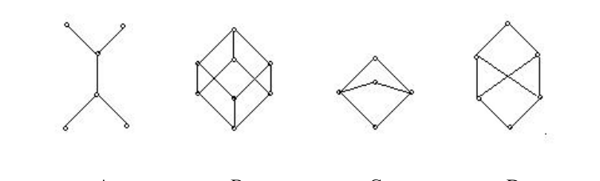
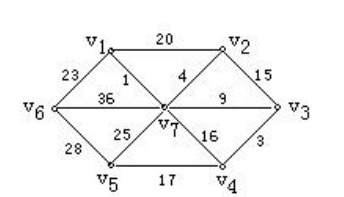

# 河南大学计算机与信息工程学院 2013～2014 学年第一学期期末考试

## 《 离散数学 》试卷（B 卷）

**考试方式：** 闭卷
**考试时间：** 120 分钟
**卷面总分：** 100 分
**适用专业：** 计算机科学与技术 / 软件工程 / 网络工程 / 人工智能

---

## 一、 单项选择题（本题共 15 小题，每小题 2 分，共 30 分）

**1. 下列语句是真命题的有______。** **[   ]**

* A. 2 是素数。
* B. $x+5 > 6$。
* C. 地球外的星球上也有人。
* D. 这朵花多好看呀！

**2. 设 $B$ 不含有 $x$，$\exists x(A(x) \to B)$ 等值于______。** **[   ]**

* A. $\exists x A(x) \to B$
* B. $\exists x(A(x) \vee B)$
* C. $\forall x A(x) \to B$
* D. $\exists x(A(x) \wedge B)$

**3. 令 $p$：今天下雪了，$q$：路滑，则命题“虽然今天下雪了，但是路不滑”可符号化为______。** **[   ]**

* A. $p \wedge \neg q$
* B. $p \vee \neg q$
* C. $p \wedge q$
* D. $p \to \neg q$

**4. 设 $S = \{\emptyset, \{1\}, \{1, 2\}\}$，则有______ $\subseteq S$。** **[   ]**

* A. $\{1, 2\}$
* B. $\{\{1, 2\}\}$
* C. $\{1\}$
* D. $\{2\}$

**5. 设函数 $f: \mathbf{Z}^+ \to \mathbf{R}, f(x) = \ln x$ （其中 $\mathbf{Z}^+$ 为正整数集，$\mathbf{R}$ 为实数集），则下面四个命题为真的是______。** **[   ]**

* A. $f$ 是单射
* B. $f$ 是满射
* C. $f$ 是双射的
* D. $f$ 非单射非满射

---

**6. 集合 $A=\{1, 2, 3, 4\}$，则对 $A$ 的元素进行划分正确的是______。** **[   ]**

* A. $\{\emptyset, \{1, 2\}, \{3, 4\}\}$
* B. $\{\{1, 2, 3\}, \{3, 4\}\}$
* C. $\{\{1, 2, 3, 4\}\}$
* D. $\{\{1\}, \{3, 4\}\}$

**7. 设 $A=\{1, 2, 3\}$，则 $A$ 上有______个二元关系。** **[   ]**

* A. $2^3$
* B. $3^2$
* C. $2^{2^3}$
* D. $2^{3^2}$

**8. 设 $S = \{1, \frac{1}{2}, 2, \frac{1}{3}, 3, \frac{1}{4}, 4\}$，$*$ 为普通乘法，则 $\langle S, * \rangle$ 是______。** **[   ]**

* A. 代数系统
* B. 半群
* C. 群
* D. 都不是

**9. 下面偏序集中的图______能构成格。** **[   ]**

  
  
<em>图1</em>

* A. 图 A
* B. 图 B
* C. 图 C
* D. 图 D

**10. 设 $F=\{1, 2\}$，则群 $\langle P(F), \cap \rangle$ 的单位元和零元是______。** **[   ]**

* A. $\emptyset$ 与 $F$
* B. $F$ 与 $\emptyset$
* C. $\{1\}$ 与 $\emptyset$
* D. $\{1\}$ 与 $F$

---

**11. 设 $\langle A, +, \cdot \rangle$ 是代数系统，其中 $+$, $\cdot$ 为普通加法和乘法，则 $A =$______ 时，$\langle A, +, \cdot \rangle$ 是整环。** **[   ]**

* A. $\{x \mid x = 2n, n \in \mathbf{Z}\}$
* B. $\{x \mid x = 2n + 1, n \in \mathbf{Z}\}$
* C. $\{x \mid x \ge 0 \text{ 且 } x \in \mathbf{Z}\}$
* D. $\{x \mid x = a + b\sqrt{5}, a, b \in \mathbf{R}\}$

**12. 下面四组数能构成无向简单图的度数列的有______。** **[   ]**

* A. (1, 1, 2, 2, 3)
* B. (2, 2, 2, 2, 2)
* C. (1, 1, 2, 2, 2)
* D. (0, 1, 3, 3, 3)

**13. 下列编码是前缀码的是______。** **[   ]**

* A. $\{1, 11, 101\}$
* B. $\{1, 001, 0011\}$
* C. $\{1, 01, 001, 000\}$
* D. $\{0, 00, 000\}$

**14. 一颗二叉树后序遍历的结果是 bdeca，中序遍历的结果是 badce，则根结点的右子树有______个结点。** **[   ]**

* A. 3
* B. 4
* C. 5
* D. 6

**15. 设无向树 $T$ 有 3 个 3 度和 2 个 2 度顶点，其余顶点都是树叶，则 $T$ 有______片树叶。** **[   ]**

* A. 3
* B. 4
* C. 5
* D. 6

---

## 二、 填空题（本题共 10 空，每空 2 分，共 20 分）

**1. 设 $A, B$ 是集合，$|A| = 3, |B| = 4, |A \cap B| = 2$，那么 $|A \cup B| = $______。**

**2. 设集合 $A = \{x \mid x = n^{109} \wedge x \in \mathbf{N}\}$，$\mathbf{N}$ 为自然数集，则 $A$ 的基数为______。**

**3. 设 $A=\{1, 2, 3\}$，$A$ 上的二元关系 $R = \{\langle 1,2 \rangle, \langle 2,1 \rangle, \langle 2,3 \rangle\}$，则 $R$ 的对称闭包是______。**

**4. 设关系 $R = \{\langle 1,3 \rangle, \langle 4,2 \rangle, \langle 2,1 \rangle\}$，则 $R^{-1} = $______。**

**5. 设 $G = \langle a \rangle$ 是 12 阶循环群，则 $G$ 的所有生成元个数有______个。**

**6. 设 $\mathbf{Z}$ 为整数集，$\forall a, b \in \mathbf{Z}$，$a \circ b = a + b - 1$，则任意 $a \in \mathbf{Z}$ 的逆元 $a^{-1} = $______。**

**7. 设 $G = \langle a \rangle$ 为 15 阶循环群，则 $G$ 的 3 阶子群是______。**

**8. 已知 $n$ 阶无向简单图 $G$ 有 $m$ 条边，则 $G$ 的补图有______条边。**

**9. $n (n \ge 3)$ 阶无向树 $T$ 中，$1 \le \Delta(T) \le $______。**

**10. 所有非同构的 4 阶根树有______棵。**

---

## 三、 计算题（本题共 4 小题，每小题 10 分，共 40 分）

**1. 给定解释 $I$：$D = \{2, 3\}$，其上二元谓词 $L(x, y)$ 满足 $L(2, 2) = 0, L(3, 3) = 1, L(2, 3) = 1, L(3, 2) = 0$。求谓词合式公式 $\exists y \forall x L(x, y)$ 的真值。**

**2. 已知 $R, S$ 是 $\mathbf{N}$ 上的关系，其定义如下：$R = \{\langle x, y \rangle \mid x, y \in \mathbf{N} \wedge y = x^2\}$，$S = \{\langle x, y \rangle \mid x, y \in \mathbf{N} \wedge y = x+1\}$。求 $R^{-1}$，$R \circ S$，$S \circ R$，$R \upharpoonright \{1, 2\}$，$S[\{1, 2\}]$。**

**3. 设 $A = \{1, 2\}$，$A$ 上所有函数的集合记为 $A^A$，$\circ$ 是函数的复合运算，试给出 $A^A$ 上运算 $\circ$ 的运算表，并指出 $A^A$ 中是否有幺元，哪些元素有逆元。**

**4. 如下图所示的赋权图表示某七个城市 $v_1, v_2, \dots, v_7$ 及预先算出它们之间的一些直接通信线路造价，试给出一个设计方案，使得各城市之间能够通信而且总造价最小。**

  
  
<em>图2</em>

---

## 四、 证明题（本题共 1 小题，共 10 分）

**1. 在自然推理系统中，构造下面推理的证明：**
**前提：$\forall x(F(x) \to G(x))$，$\exists x(F(x) \wedge H(x))$**
**结论：$\exists x(G(x) \wedge H(x))$**
