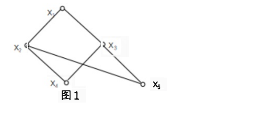
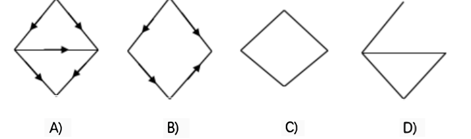

# 河南大学 2022-2023 学年第一学期期末考试试卷

## 《 离散数学 》试卷

**考试方式：** 闭卷
**考试时间：** 90 分钟
**卷面总分：** 100 分
**适用专业：** 计算机科学与技术 / 软件工程 / 网络工程 / 人工智能

---

## 一、 填空题（本题共 5 小题，每空 3 分，共 30 分）

**1. 设关系 $R = \{\langle 1,2 \rangle, \langle 3,4 \rangle, \langle 2,2 \rangle\}$ 和 $S = \{\langle 4,2 \rangle, \langle 2,5 \rangle, \langle 3,1 \rangle, \langle 1,3 \rangle\}$，则 $S \circ R = $______，$R^2 = $______。**

**2. 设集合 $P = \{x_1, x_2, x_3, x_4, x_5\}$ 上的偏序关系如图 1 所示，其子集 $\{x_2, x_3, x_4\}$ 的上界为______，上确界为______，下界为______，下确界为______。**

  
  
<em>图1</em>

**3. 设代数系统 $V = \langle G, * \rangle$，其中 $G = \{a^n \mid n \in \mathbf{Z}\}$ 且 $a$ 为正整数（$a \ne 1$），$*$ 为普通乘法，则 $V$ 为群，其 $*$ 运算的幺元为______；任一元素 $a^n$ 的逆元为______。**

**4. 只要别人有困难，老王就帮助别人，除非困难解决了。令 $P$：别人有困难；$Q$：老王帮助别人；$R$：困难解决了。命题符号化为______。**

**5. 设 $N(e)$ 表示 $e$ 是自然数，$G(e_1, e_2)$ 表示 $e_1 \ge e_2$，则命题“没有一个自然数大于等于任何自然数”可符号化为：______。**

---

## 二、 单项选择题（本题共 6 小题，每小题 5 分，共 30 分）

**1. 设 $R^*$ 为非零实数集合，下列运算不可结合的是______。** **[   ]**

* A. $a * b = \frac{a}{b}$
* B. $a \circ b = b$
* C. $a \Delta b = ab$
* D. $a \diamond b = a + b$

**2. 在布尔代数中，下列各式不正确的是______。** **[   ]**

* A. $a \wedge ( \overline{a} \vee b ) = a \wedge b$
* B. $a \vee ( \overline{a} \wedge b ) = a \vee b$
* C. $\overline{a \vee b} = \overline{a} \wedge \overline{b}$
* D. $\overline{a \vee b} = a \wedge \overline{b}$

**3. 已知 $\langle L_1, \le \rangle, \langle L_2, \le \rangle, \langle L_3, \le \rangle$ 为 3 个偏序集，其中 $L_1 = \{1, 2, 3, 5, 6, 15, 30\}$，$L_2 = \{2, 3, 6, 12, 24, 36\}$，$L_3 = \{1, 2, 3, 6, 18, 54\}$，$\le$ 为整除，则下列结论正确的是______。** **[   ]**

* A. $\langle L_1, \le \rangle, \langle L_3, \le \rangle$ 是格
* B. $\langle L_1, \le \rangle, \langle L_2, \le \rangle$ 是格
* C. $\langle L_2, \le \rangle, \langle L_3, \le \rangle$ 是格
* D. $\langle L_1, \le \rangle$ 是格

---

**4. 一个 $n$ 点的非连通图 $G$ 的连通度 $\kappa(G)$ 为______。** **[   ]**

* A. 0
* B. 1
* C. $n - 1$
* D. $n$

**5. 下列各图中为汉密尔顿图的是______。** **[   ]**

  

* A. 图 A
* B. 图 B
* C. 图 C
* D. 图 D

**6. 在图 $G$ 中，若 $E(G) = \emptyset$ 且 $|V(G)| = 3$，则称 $G$ 为______。** **[   ]**

* A. 3 阶正则图
* B. 3 阶空图
* C. 3 阶平凡图
* D. 3 阶零图

---

## 三、 证明题（本题共 4 小题，每小题 10 分，共 40 分）

**1. 设 $A, B, C$ 为集合 $X$ 上的二元关系。证明：$A \circ (B \cup C) = A \circ B \cup A \circ C$。**

**2. 令 $g \circ f$ 是一个复合函数。证明：若 $g$ 和 $f$ 是双射函数，则 $g \circ f$ 是双射函数。**

---

**3. 证明：设 $R_1$ 和 $R_2$ 为非空集合 $A$ 上的等价关系，则 $R_1 = R_2$ 当且仅当 $A/R_1 = A/R_2$。**

**4. 设 $R$ 是集合 $A$ 上的一个自反关系。求证：$R$ 是对称和传递的，当且仅当若 $\langle x,y \rangle \in R$ 且 $\langle x,z \rangle \in R$，则 $\langle y,z \rangle \in R$。**

---
