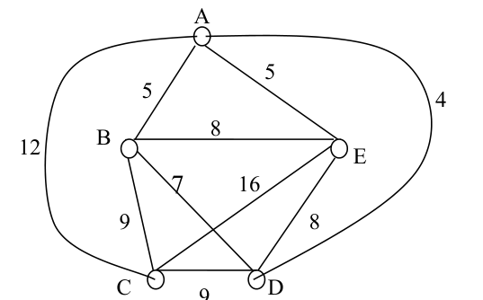

# 河南大学计算机与信息工程学院期末考试

## 《 离散数学 2 》试卷

**考试方式：** 闭卷
**考试时间：** 120 分钟
**卷面总分：** 100 分
**适用专业：** 计算机科学与技术 / 软件工程 / 网络工程 / 人工智能

---

## 一、 判断题（本题共 10 小题，每小题 2 分，共 20 分）

**1. 任何两个永真公式的合取不一定是一个永真公式。** **(   )**

**2. 如果 $A \cap B = A \cap C$，则 $B = C$。** **(   )**

**3. 如果有限集合 $A$ 有 $n$ 个元素，则其幂集有 $2^n$ 个元素。** **(   )**

**4. 有 3 个元素的集合共有 6 种不同的划分。** **(   )**

**5. 设 $A = \{1, 2, 3, 4, 5, 6\}$，$R$ 为 $A$ 上的整除关系，则 $A$ 的最大元是 6。** **(   )**

---

**6. $\Pi_1$ 和 $\Pi_2$ ($\Pi_1 \neq \Pi_2$) 是非空集合 $A$ 的划分，则 $\Pi_2 \cap \Pi_1$ 一定不会是 $A$ 的划分。** **(   )**

**7. 无向图具有一条欧拉路，当且仅当是连通的，且有零个或两个奇数度结点。** **(   )**

**8. 简单图的最小度小于顶点数。** **(   )**

**9. 一个有向图是强连通的充要条件是存在经过每个顶点的回路。** **(   )**

**10. 设 $n$ 阶无向连通 $G$ 有 $m$ 条边，则 $m \ge n-1$。** **(   )**

---

## 二、 单项选择题（本题共 10 小题，每小题 2 分，共 20 分）

**1. 分析下列语句，哪个不是命题？______。** **[   ]**

* A. 北京是中国的首都。
* B. 火星上有生物。
* C. 如果天气好，那么我去散步。
* D. 天气多好啊！

**2. 下面哪一种图不一定是树______。** **[   ]**

* A. 无回路的连通图
* B. 有 $n$ 个结点，$n-1$ 条边的连通图
* C. 每对结点间有路的图
* D. 连通但删去一条边不连通的图

**3. 谓词公式 $\forall x (P(x) \to Q(x))$ 中变元 $x$ 是______。** **[   ]**

* A. 自由变元
* B. 既是自由变元，也是约束变元
* C. 约束变元
* D. 既不是自由变元，也不是约束变元

**4. 谓词公式 $\forall x (P(x) \to Q(x))$ 中量词 $\forall$ 的辖域是______。** **[   ]**

* A. $\forall x (P(x) \to Q(x))$
* B. $P(x)$
* C. $P(x) \to Q(x)$
* D. $Q(x)$

**5. 集合 $A = \{0, 1, 2\}$ 上的四个关系中，哪个是等价关系？______。** **[   ]**

* A. $R_1 = \{\langle 0,0 \rangle, \langle 1,1 \rangle, \langle 2,2 \rangle, \langle 1,2 \rangle\}$
* B. $R_2 = \{\langle 0,0 \rangle, \langle 1,1 \rangle, \langle 2,2 \rangle, \langle 0,1 \rangle, \langle 1,0 \rangle\}$
* C. $R_3 = \{\langle 0,0 \rangle, \langle 1,1 \rangle, \langle 2,2 \rangle, \langle 0,2 \rangle, \langle 2,1 \rangle\}$
* D. $R_4 = \{\langle 0,1 \rangle, \langle 1,0 \rangle, \langle 0,0 \rangle, \langle 1,1 \rangle\}$

---

**6. 已知 $A \oplus B = \{1, 2, 3\}$，$A \oplus C = \{2, 3, 4\}$，若 $2 \in B$，则____________。** **[   ]**

* A. $1 \in C$
* B. $2 \in C$
* C. $3 \in C$
* D. $4 \in C$

**7. 集合 $A$ 到 $B$ 共有 64 个不同的函数，则 $B$ 中元素不可能有____________个。** **[   ]**

* A. 4
* B. 8
* C. 16
* D. 64

**8. 设 $\langle G, * \rangle$ 是阶大与 1 的群，则下列命题中，____________不真。** **[   ]**

* A. 存在零元
* B. 存在幺元
* C. 运算 $*$ 是可结合的
* D. $G$ 中每个元素必有逆元

**9. 下面的二元关系中，哪个是传递的？____________** **[   ]**

* A. 朋友关系
* B. 集合的包含关系
* C. 父子关系
* D. 实数不相等关系

**10. 设 $P$ 和 $Q$ 都是命题，则 $\neg P \wedge \neg Q$ 的真值为真当且仅当：____________** **[   ]**

* A. $P$ 为真，$Q$ 为真
* B. $P$ 为真，$Q$ 为假
* C. $P$ 为假，$Q$ 为真
* D. $P$ 为假，$Q$ 为假

---

## 三、 填空题（本题共 5 小题，每小题 3 分，共 15 分）

**1. 设 $P$：天下雨，$Q$：天刮风，$R$：我去书店，则命题“如果天不下雨并且不刮风，我就去书店”的符号化形式为____________。**

**2. 设 $A = \{a, b\}$，则集合 $A$ 的幂集为____________。**

**3. 设 $A = \{a, b, c, d, e, f\}$，$A$ 上的等价关系 $R = I_A \cup \{\langle a, b \rangle, \langle b, a \rangle\}$，则 $a$ 的等价类 $[a]_R = $____________。**

**4. 在一个推有 $n$ 个元素的集合上，可以有____________种不同的关系。**

**5. 设集合 $A = \{a, b, c\}$ 上关系 $R = \{\langle a, a \rangle, \langle a, b \rangle\}$，则 $t(R) = $____________。**

---

## 四、 计算题（本题共 4 小题，共 25 分）

**1. (6 分) 用等值演算法，求 $P \vee (Q \wedge R)$ 的主析取范式，并按 $P, Q, R$ 顺序，写成编码形式。**

**2. (6 分) 已知 $R, S$ 是 $\mathbf{N}$ 上的关系，其定义如下：$R = \{\langle x, y \rangle \mid x, y \in \mathbf{N} \wedge y = x^2\}$，$S = \{\langle x, y \rangle \mid x, y \in \mathbf{N} \wedge y = x+1\}$。求 $R^{-1}$，$R \circ S$，$S \circ R$。**

**3. (7 分) 设 $A = \{a, abc, bc, bcd, bd\}$，定义 $A$ 上二元关系 $R = \{\langle x, y \rangle \mid x, y \in A \text{ 且字符串 } x \text{ 包含于字符串 } y \text{ 中}\}$，即 $R = I_A \cup \{\langle a, abc \rangle, \langle bc, abc \rangle, \langle bc, bcd \rangle\}$。可以验证 $R$ 是 $A$ 上的偏序关系。**
*(1)* 作出 $R$ 的哈斯图；
*(2)* 向 $R$ 中最少添加几个序偶可使之成为等价关系？求出该等价关系所确定的集合 $A$ 的划分。

**4. (6 分) 在通信中，设字符 a, b, c, d, e, f, g, h 出现的频率如下：**
* **a: 25%**
* **b: 20%**
* **c: 15%**
* **d: 10%**
* **e: 10%**
* **f: 10%**
* **g: 5%**
* **h: 5%**

**采用 2 元前缀码，求传输数字最少的 2 元前缀码（称作最佳前缀码）。**

---

## 五、 综合题（本题共 2 小题，每小题 10 分，共 20 分）

**1. (10 分) 城市间道路的连接情况如图所示，现在要用通讯线路把这些城市联系起来，边上的数字表示沿道路架设线时所需的费用（单位：万元），要求设计一个最经济的铺设通讯线路的方案，并求所需的总费用。**

  

**2. (10 分) 构造下列推理的证明。**
**前提：$\neg p \vee q$，$\neg q \vee r$，$r \to s$**
**结论：$p \to s$**
