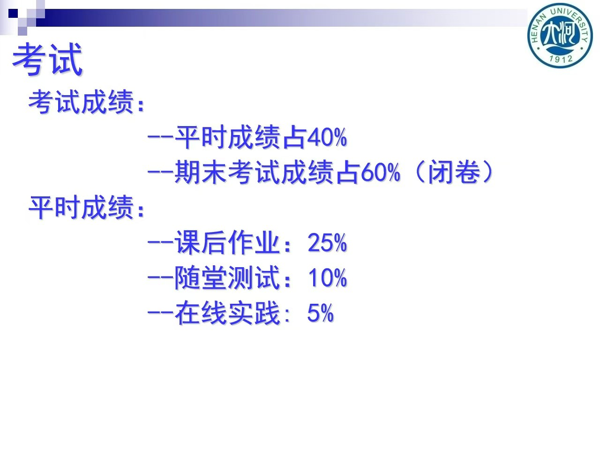

# 离散数学课程成绩构成与考试说明

本文件说明了离散数学课程的最终成绩评定标准及平时成绩构成比例。

---

## 一、 考试成绩构成

* **平时成绩**：占总成绩的 `40%`
* **期末考试成绩**：占总成绩的 `60%` (闭卷考试)

---

## 二、 平时成绩明细

* **课后作业**：占平时成绩的 `25%`
* **随堂测试**：占平时成绩的 `10%`
* **在线实践**：占平时成绩的 `5%`

---

## 三、 成绩构成幻灯片原图

为便于查阅，以下为课程组发布的成绩构成说明原图：

  
  
<em>图1：离散数学成绩构成及占比幻灯片</em>

